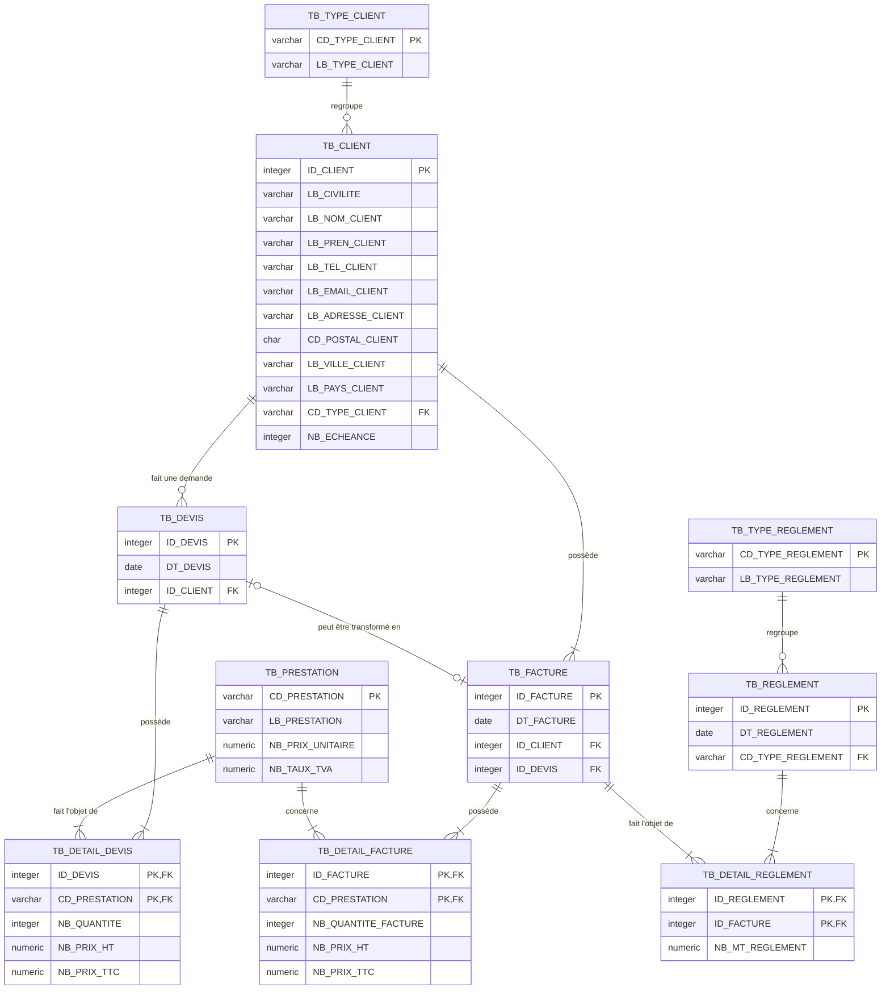
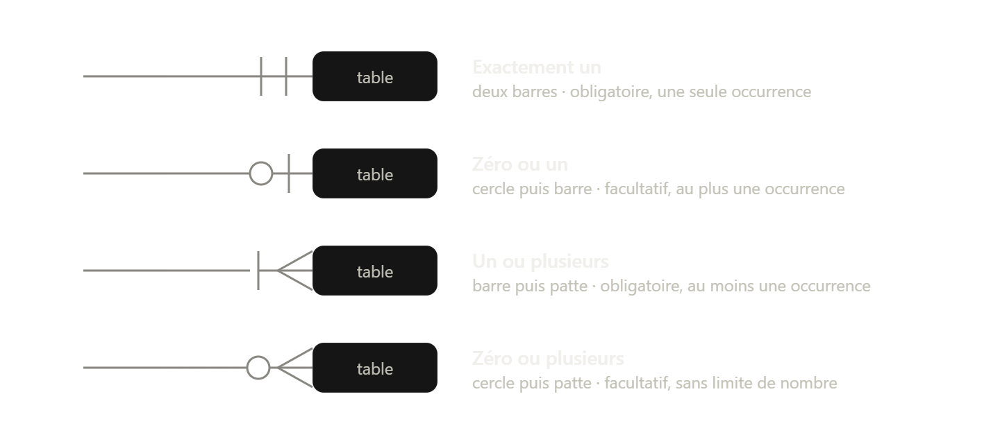

# Base de données : Gestion des prestations de service

Modèle relationnel PostgreSQL couvrant le cycle commercial complet : devis, facturation et règlements.

## Modèle physique de données

### Comment lire le diagramme
---
 - **barre = un**
 - **cercle = zéro**
 - **patte de corbeau = plusieurs**.

  

Chaque extrémité de relation porte deux symboles. Celui **collé à la table**
indique le nombre maximum, celui **placé juste avant** le nombre minimum.

| Symbole rendu | Mermaid | UML | Côté Power BI | Signification |
|---|---|---|---|---|
| deux barres | `\|\|` | `1` | `1` | exactement un (une seule occurrence , obligatoire) |
| cercle puis barre | `o\|` | `0..1` | `1` | zéro ou un (au plus une occurrence , facultative) |
| barre puis patte de corbeau | `\|{` | `1..*` | `*` | un ou plusieurs (au moins une occurrence , obligatoire) |
| cercle puis patte de corbeau | `o{` | `0..*` | `*` | zéro ou plusieurs (sans limite, facultative) |

*Power BI ne fait que *lire*
des données déjà validées, il ne code donc que le maximum de ce fait, chez lui, il y a
deux côtés possibles : `1` ou `*`. Or les SGBD comme PostgreSQL, eux, *écrivent* et doivent
refuser les données incohérentes, la distinction entre minimum 0 et minimum 1
est indispensable et représente une contrainte réelle.*

**Traduction en contraintes PostgreSQL :** 
- Un minimum de 1 se traduit par
`NOT NULL` sur la clé étrangère
- Un minimum de 0 l'autorise à être `NULL`
- Un maximum de 1 côté enfant impose un `UNIQUE` sur la clé étrangère.

**Exemples dans ce modèle :**

| Relation | Notation Mermaid | Lecture métier | Équivalent Power BI |
|---|---|---|---|
| Client → Devis | `TB_CLIENT \|\|--o{ TB_DEVIS` | Un client peut n'avoir aucun devis ou en avoir plusieurs ; chaque devis appartient à exactement un client. | Un-à-plusieurs |
| Devis → Détail devis | `TB_DEVIS \|\|--\|{ TB_DETAIL_DEVIS` | Un devis contient obligatoirement au moins une ligne ; un devis vide n'a pas de sens métier. | Un-à-plusieurs (la nuance « au moins une » est perdue) |
| Devis → Facture | `TB_DEVIS \|o--o\| TB_FACTURE` | Un devis peut être transformé en facture ou rester sans suite ; une facture peut naître d'un devis ou être émise directement. | Un-à-un |

## Choix de conception

- `numeric` pour tous les montants, les types flottants introduisent des
  erreurs d'arrondi, inacceptables sur des prix.
- Clé primaire composite sur les tables de détail : une ligne est identifiée
  par le couple (document, prestation), sans identifiant technique.
- `UNIQUE` sur `ID_DEVIS` dans `TB_FACTURE` : matérialise le un-à-un optionnel
  entre devis et facture.

## Structure

| Dossier | Contenu |
|---|---|
| `sql/` | Scripts numérotés, à exécuter dans l'ordre |
| `images/` | Modèle conceptuel |

## Référence
Projet réalisé en suivant la formation PostgreSQL d'iData :
[playlist YouTube](https://www.youtube.com/watch?v=fyri49fD2yk&list=PLOwKN2nB1sseE9SVO9vHO3EFZ3-55qBmk) ·
[dépôt GitLab source](https://gitlab.com/radda/formationpostgresql/-/tree/main)
